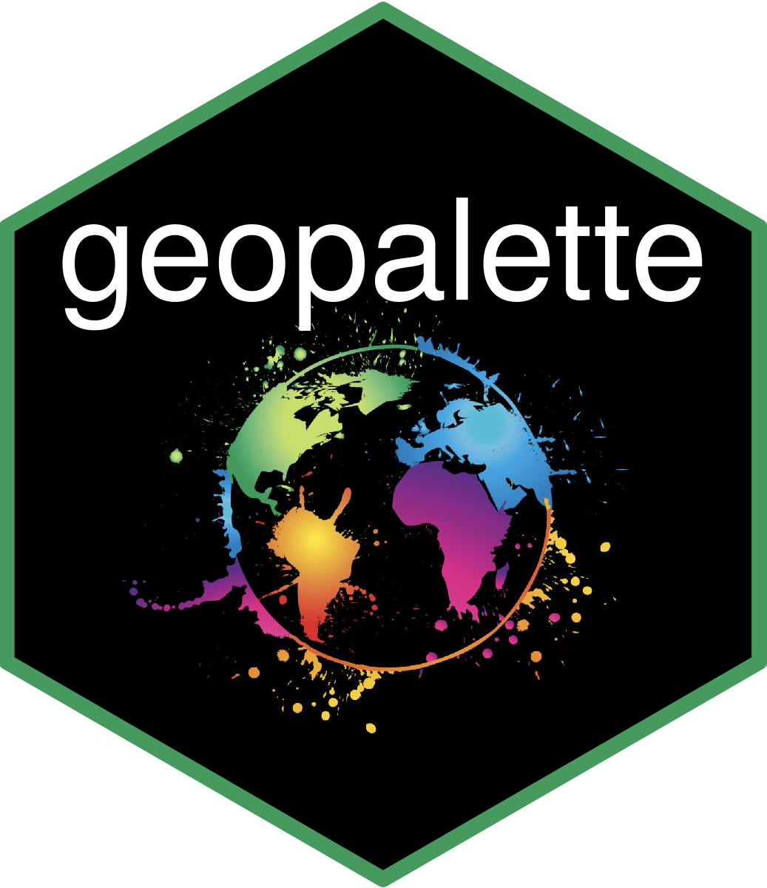

<!-- README.md is generated from README.Rmd. Please edit that file -->

```{r, include = FALSE}
knitr::opts_chunk$set(
  collapse = TRUE,
  comment = "#>",
  fig.path = "man/figures/README-",
  out.width = "100%"
)
```

# geopalette <a href='https://github.com/baynec2/geopalette'></a>

<!-- badges: start -->
[](https://github.com/baynec2/geopalette/actions/workflows/R-CMD-check.yaml)
<!-- badges: end -->


The goal of geopalette is to provide a fun new way to make color palletes based on a user specified location! In short, this package contains everything necessary to pull down satellite information from a given location, extract the color data from it, and then make a color palette. 

Is this necessary, or the best way to choose a color palette? No of course not, but it might be kinda cool! 


## Installation

You can install the development version of Geopalette like so:

``` r
devtools::install_github(baynec2/geopalette)

```

## Examples

```{r example}
library(geopalette)
## basic example code
```


First, lets look at the colors from the town I grew up in, Culpeper VA. 
To get the pallete we need to first build the right url that can get the desired image from the google API. We can do this using google_image_request_url(). After that, we can read the image using read_image_url(). Then we determine the unique_colors(), sort the colors, and finally plot.  


```{r}
library(ggplot2)

culpeper = google_image_request_url("Culpeper,VA","city") %>% 
  read_image_url() %>% 
  determine_unique_colors() %>% 
  sort_colors() %>% 
  plot_unique_colors()+
  ggtitle("Culpeper")

culpeper


```


What if you wanted to visually inspect the image that the pallete is extracted from? You could do that using the show_image function as shown below. 

```{r}
google_image_request_url("Culpeper,VA","city") %>% 
  read_image_url() %>% 
  show_image()

```


I live in San Diego now. As another example, lets look at the colors found there.

```{r}
Sandiego = google_image_request_url("SanDiego,CA","city") %>% 
  read_image_url() %>% 
  determine_unique_colors() %>% 
  sort_colors() %>% 
  plot_unique_colors()+
  ggtitle("Sandiego")

Sandiego
```

Perhaps not surprisingly, the colors found in San diego are very different looking from those in colors.

While these plots represent the unique colors found at each location, we still want to be able to create a palette from them. This should work by sorting the colors by similarity and then grouping into 8 distinct groups to form the palette. 

```{r}
culpeper = google_image_request_url("Culpeper,VA","city") %>% 
  read_image_url() %>% 
  determine_unique_colors() %>% 
  sort_colors() 

culpeper_pal = create_palette(culpeper)

plot_unique_colors(culpeper_pal(8))
```

Now let's look at the same thing when using san diego as a source image. 

```{r}
sandiego = google_image_request_url("Sandiego,CA","city") %>% 
  read_image_url() %>% 
  determine_unique_colors() %>% 
  sort_colors() 

sandiego_pal = create_palette(sandiego)

plot_unique_colors(sandiego_pal(8))
```


## BaseR Plotting  

You can use these palettes with base R graphics like so:  

```{r}
plot(iris$Petal.Length, iris$Petal.Width, pch=21,bg = sandiego_pal(3)[iris$Species])
legend(1, 2.5, legend=unique(iris$Species),
       col=unique(sandiego_pal(3)[iris$Species]), lty=1:2, cex=0.8)
```


## GGplot2 

There is support for ggplot2 graphics through the scale_fill_geopalette()  and the scale_color_geopalette() functions.

For plots that need to be colored by fill, such as bar graphs, use the scale_fill_geopalette() function like so:  

```{r}
p1 = mtcars %>% 
  as.data.frame() %>% 
  tibble::rownames_to_column("car") %>% 
  ggplot(aes(car,mpg,fill = car))+
  geom_col()+
  scale_fill_geopalette("Culpeper,VA",zoom = "city")+
  theme(axis.text.x = element_blank())

p1
```


Let's do the same for San Diego just to see what it looks like. 


```{r}
p1 = mtcars %>% 
  as.data.frame() %>% 
  tibble::rownames_to_column("car") %>% 
  ggplot(aes(car,mpg,fill = car))+
  geom_col()+
  scale_fill_geopalette("SanDiego,CA",zoom = "city")+
  theme(axis.text.x = element_blank())

p1

```

For plots that have colored points instead of filled, like a scatter plot, we can use scale_color_geopalette() as shown below. If the values are continuous instead of discrete, we need to change the discrete argument to FALSE. 


```{r}
p1 = mtcars %>% 
  as.data.frame() %>% 
  tibble::rownames_to_column("car") %>% 
  ggplot(aes(hp,mpg,color = mpg))+
  geom_point()+
  scale_color_geopalette("Culpeper,VA",zoom = "city",discrete = FALSE)


p1
```

Lastly, lets see what this looks like for san diego. 


```{r}
p1 = mtcars %>% 
  as.data.frame() %>% 
  tibble::rownames_to_column("car") %>% 
  ggplot(aes(hp,mpg,color = mpg))+
  geom_point()+
  scale_color_geopalette("SanDiego,CA",zoom = "city",discrete = FALSE)


p1
```


## Future work

There are a few problems with the current iteration of geopallete that I hope to fix in the future if I have time. These are listed below:

1. Often times not a very good separation of colors in the palette. When plotting, it can be hard to distinuguish one group from another. 
2. Continuous color palettes are often not intuitivly sorted (sorting colors is not a trivial task).
3. White can be in the palette, causing these points to be non visable. 
